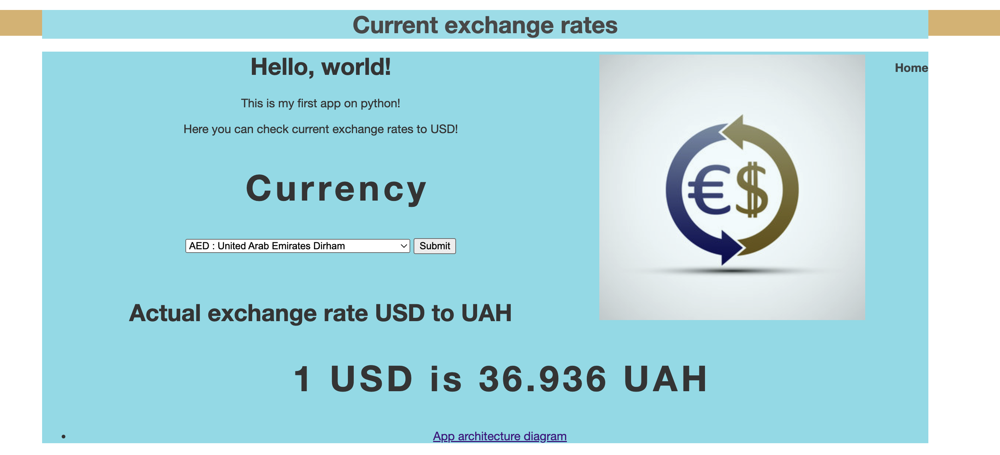
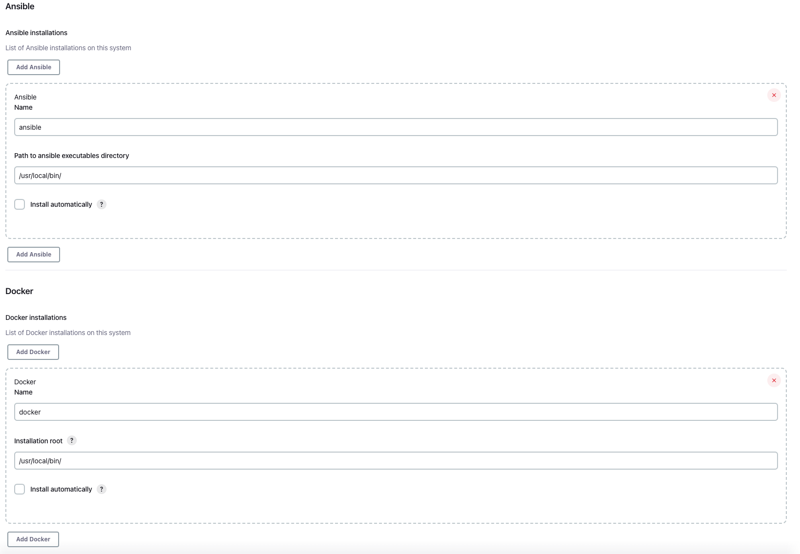
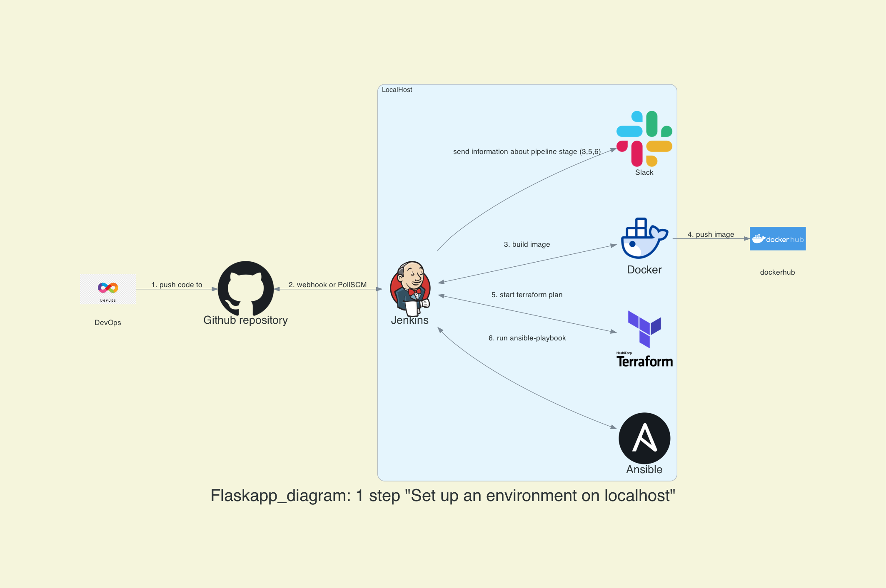
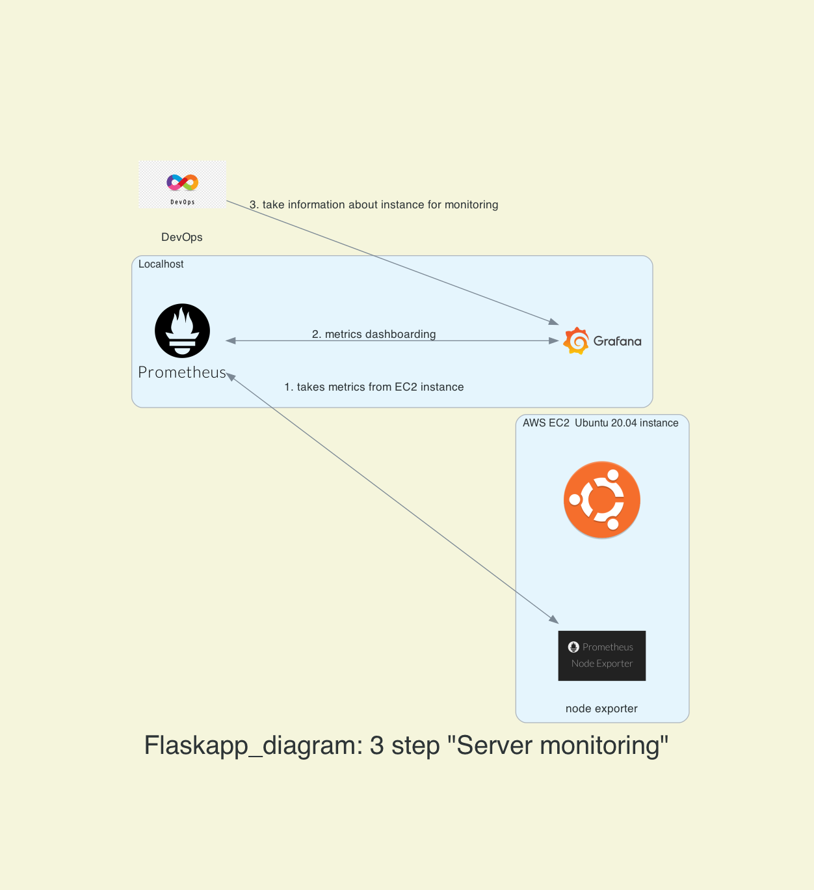

# Flaskapp "Exchange rates" 



### ___ *Hello, everyone! This is my first app on python! This app can help you check the actual currency exchange rate to USD!* ___

## Content
* [Deploying on localhost](#deploying-on-localhost)

* [Deploying on AWS EC2 instance](#deploying-on-remote-host)
    * [Required tools](#for-deploying-that-app-on-you-have-to-use-next-tools)
    * [AWS configurations](#aws-configuration)
    * [Jenkins configuration](#jenkins-configurations)
    * [App architecture diagram](#app-architecture-diagram)
## Deploying on localhost:
### To run this app on localhost yot have to install and setup necessary tools:
- Docker
- Git

After that run the following commands:

#create folder and clone repo below:
```
$ git clone https://github.com/PavloTarnovetskyi/Flaskapp.git
_________________________________________________________________

$ cd app&dockerfile
_________________________________________________________________

$ docker build -t flaskapp .
_________________________________________________________________

$ docker run -d -p5000:5000 flaskapp
```
You can find this app in your browser follow the link: http://127.0.0.1:5000 


# Deploying on remote host:
If you want to deploy this app on the remote host, like an AWS EC2 instance, you can do it too.
### In this repo, you can find all the necessary files to deploy this app at the AWS EC2 instance.


## For deploying that app on  you have to use next tools:
- Jenkins 
- Docker
- Terraform
- Ansible
- AWS 
- Git 

 For deploying that app on AWS EC2 you have to use your AWS account with your AWS user credentials that terraform will use to deploy infrastructure.

## Jenkins configurations
 Another important thing is to set up Jenkins with the necessary plugins and create a new job that will use a pipeline script from SCM.
 1. Install the following plugins:
- Docker pipeline
- Terraform Plugin
- CloudBees AWS Credentials
- Ansible plugin

 In Jenkins Global Tool Configuration you have to set up Docker, Ansible and Terraform. You can specify the path to your local installed tools or tick install automatical.


## App architecture diagram
In the picture below, you can see a diagram of how different programs on your computer interact with each other.


In the picture below, you can see a diagram of how different programs interact with each other on a remote server.


If you want to monitor your remote host, below there is another diagram. 

  

